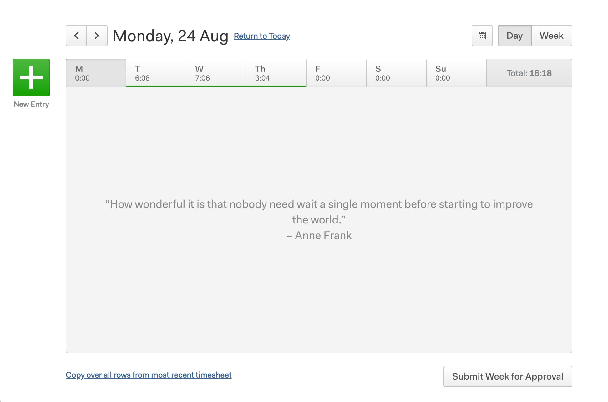

# Harvest Time Tracker Simplifier

Hide the header and footer for a simple tracking experience

**[Install from Greasyfork](https://greasyfork.org/en/scripts/410006-harvest-time-tracker-simplifier)**

## Description

Simply hides the header and footer bars on harvestapp.com so you can track your time using the website without unnecessary elements cluttering the page.

To show the header and footer, press "H" on the keyboard.

## Screenshots

