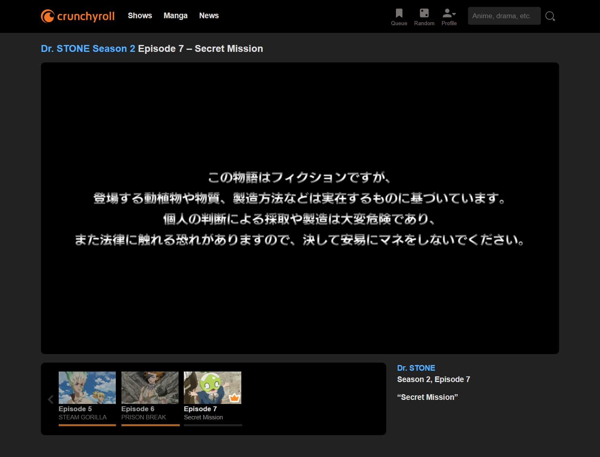
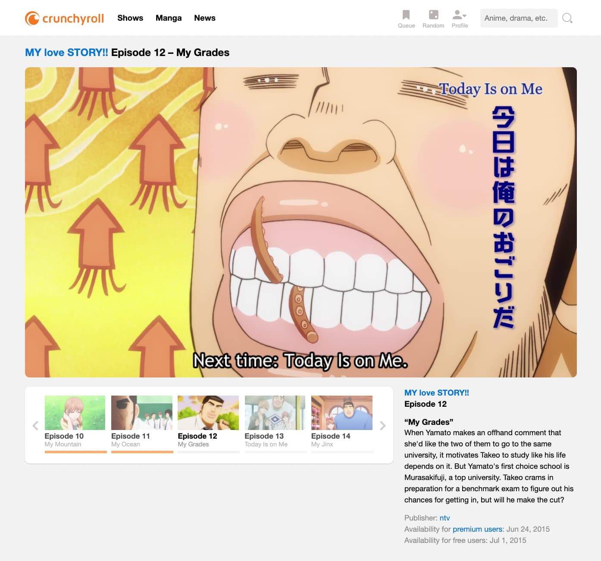

# Smoothroll

Clean crunchyroll viewing experience

**[Install from Greasyfork](https://greasyfork.org/en/scripts/422224-smoothroll)**

## Description

Cleans up the watch page of Crunchyroll.

- Removes banners
- Removes comments
- Cleaner style
- Dark mode that matches your system theme
- Script settings

Note this script only alters the page with the video player on it.

## Screenshots

## Changelog

### v0.7 (Jul 25, 2021)

- Use tampermonkey storage as well as localstorage so that data is saved if localstorage is cleared

### v0.6 (Jun 3, 2021)

- Additional info setting
- Better comments styling in dark mode

### v0.5 (Jun 3, 2021)

- Setting to show/hide comments section

### v0.4 (Jun 3, 2021)

- Add settings dialog to control the script
- More options coming soon

### v0.3 (Mar 25, 2021)

- Remove new banner

### v0.2 (Feb 28, 2021)

- Remove subtitle info etc.

### v0.1 (Feb 24, 2021)

- Initial release
