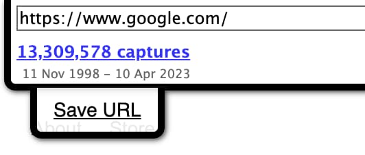

# Web Archive Save Link

Adds a save button to web archive pages

**[Install from Greasyfork](https://greasyfork.org/en/scripts/5836-web-archive-save-link)**

## Description

Just adds a simple 'save' button to the header on all web archive pages. (http://web.archive.org)

## Screenshots

## Changelog

### v2.0 (Apr 10, 2023)

- Updated to work as of April 2023

### v1.5 (Mar 15, 2015)

- Some bugs fixed

### v1.4 (Oct 18, 2014)

- Initial release
